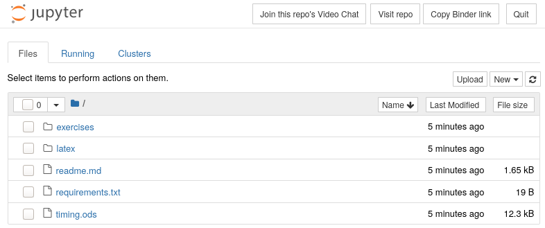

# Lecture and Material for "Programming Paradigms and Patterns" at the iCSC 2020

This repository contains the source code of the lecture slides as well as the
exercises.

The course was presented September/October 2020 at the [iCSC 2020](https://indico.cern.ch/event/853710/).

## Getting help

During the event, there are two channels on CERN mattermost (you might need to create a CERN lightweight account, which is free for everyone):

* [Programming Paradigms](https://mattermost.web.cern.ch/csc/channels/programming-paradigms)
* [Software Design Patterns](https://mattermost.web.cern.ch/csc/channels/software-design)

After the event, you can open an issue in this repository.

## Running the exercises

If you're completely new to this, use option 1 or 2. If you already have python and Jupyter set up on your computer, we recommend option 3.

**IMPORTANT NOTE**: The exercises might still be updated up to the lecture. In particular the Patterns exercises are not complete yet.

### Option 1: Using binder

This means you don't have to install anything, but you can simply use the binder service
to provide you with a Jupyter environment in your browser.
It might be a bit slow to start up, but once it's running you're ready to go!

Simply click on the following link:

[](https://mybinder.org/v2/gh/klieret/icsc-paradigms-and-patterns/master)

You should see something like this:


After some time (don't worry if it takes 5 minutes) you are brought to the Jupyter server:



Navigate on ``exercises`` and then click on one of the two notebooks (``patterns.ipynb`` or ``paradigms.ipynb``) to start your training!

If you've never use Jupyter notebook, you can also do [this training](https://mybinder.org/v2/gh/ipython/ipython-in-depth/master?filepath=binder/Index.ipynb) or take a look at [the documentation](https://jupyter-notebook.readthedocs.io/en/stable/notebook.html). But basically you can execute a cell by hitting ``Shift+Enter`` and add cells with the menu.

### Option 2: Google colab

Simply click the link (you need to log in to your google account though)

* [Programming Paradigms ](https://colab.research.google.com/github/klieret/icsc-paradigms-and-patterns/blob/master/exercises/paradigms.ipynb)
* [Software Design Patterns ](https://colab.research.google.com/github/klieret/icsc-paradigms-and-patterns/blob/master/exercises/patterns.ipynb)

If you've never used Google colab, you can also go to [this page](https://colab.research.google.com/notebooks/intro.ipynb) and try it out (but it's very similar to Jupyter notebooks if you're familiar with that). 

### Option 3: Local run

You need to have python3 and its package manager pip3.

Clone the repository

```sh
git clone git@github.com:klieret/icsc-paradigms-and-patterns.git
cd icsc-paradigms-and-patterns
```

Make sure you have the required python packages:

```sh
pip3 install -r requirements.txt
```

Then run the Jupyter notebook

```sh
jupyter-notebook
```

It should open in your browser.

## Generating lecture slides from source

You need to use [XeLaTeX](https://en.wikipedia.org/wiki/XeTeX):

```sh
cd latex
mkdir -p build && xelatex --ouput-directory build -shell-escape software_patterns.tex
mkdir -p build && xelatex --ouput-directory build -shell-escape software_paradigms.tex
```

The ``-shell-escape`` flag is needed for code highlighting. You might need to install
the pygments package.

The slides work with overlays (partial reveals of bullet points and other elements).
As this is less practical for studying yourself, take a look at the main ``.tex`` file
and change ``\handoutfalse`` to ``\handouttrue`` if needed.

## Developing this further

We are planning to convert this into a training similar to that of the [Software Carpentry](https://software-carpentry.org/) in order to be included in the [HSF curriculum](https://hepsoftwarefoundation.org/training/curriculum.html). Help is much appreciated. 

If you have any particular comments, feel free to open an issue on github for this repository.